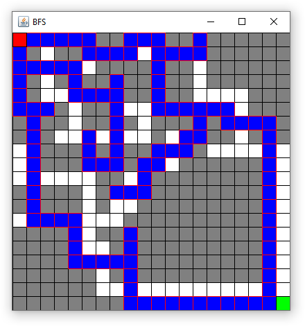

# JiotBFS

JiotBFS is a Java program that implements the breadth-first search algorithm and visually displays the path the algorithm took to reach its destination.

# Building
Java Implementation Of The Breadth First Search can be build using gradle command: 

    gradle jar
    
The built jar will be located in directory `/build/libs/`

# Usage 
Use:

    java -jar jiobfs.jar
    
# Resources

* [Breadth First Search or BFS for a Graph](https://www.geeksforgeeks.org/breadth-first-search-or-bfs-for-a-graph)
